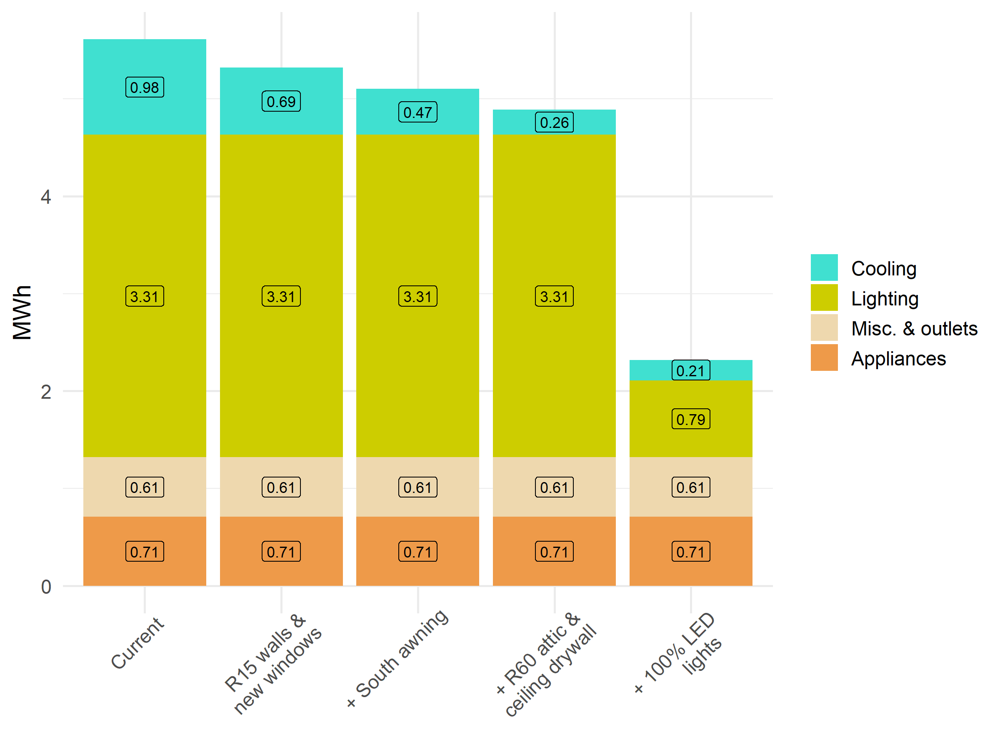
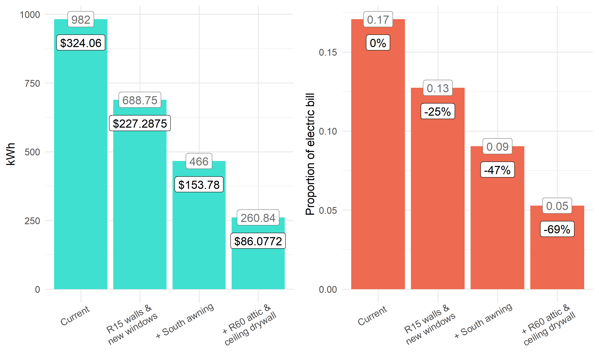

NCYC Energy models
================
Riley M. Anderson
March 07, 2026

  

- [Overview](#overview)
  - [Summary of Results](#summary-of-results)
- [BEopt model results:](#beopt-model-results)
- [Cooling loads](#cooling-loads)
- [Session Information](#session-information)

## Overview

This markdown shows the results from 5 BEopt (Building Energy
Optimization) models. BEopt takes inputs describing a building,
everything from azimuth to water heater set point and simulates seasonal
weather patterns for the nearest locale (Hartford, CT) to determine
energy usage.

Five models were built to describe:

1)  the current clubhouse structure as is (March 2026)

2)  insulate south wall with R15 mineral wool and replace the windows
    with modern, double pane, insulated, low-e windows

3)  condition 2 plus an awning on the south wall that completely shades
    the windows in the summer months

4)  condition 3 plus air sealing the ceiling with drywall and insulating
    the attic to R60 (cellulose or batts)

5)  condition 4 plus replacing every light with LEDs

**Assumptions made**

- Framing is 2x4, 16” o.c. with marginal insulation, ~ R7 (old
  fiberglass batts)
- Current air leakage is substantial 10-15 ACH50
- Most air leakage occurs at the ceiling-attic interface
- Attic insulation is sub optimal (both in amount and installation) ~
  R20
- Current windows are a mixture of single and double glazed,
  uninsulated, leaky ~ U value: \> 0.6
- Airtight ceiling drywall brings total air leakage down to 5 ACH50
- All current lighting is not LED
- Plug loads are 25% of normal household usage
- Cooling set point is 76 F with conditioning between June 1 and Sep 1
- BEopt doesn’t directly model seasonally-occupied buildings so inputs
  schedules were adjusted to approximate seasonal usage from May 1 to
  Nov 15
- Water heater and plumbing components were excluded from these models
  to simplify energy schedules and limit the results to electric
  consumers only (our water heater is propane)

### Summary of Results

- BEopt cannot tell us how much cooler the clubhouse will be with these
  upgrades but it can tell us the *cooling loads* across each condition.
  We’ll use these loads as proxies for the reduction in heat in the
  summer.

- In its current condition, the clubhouse would use about 1 MWh for
  cooling.

- Insulating the south wall and replacing the windows would cut that
  amount by 25%. Continuing with the energy upgrades, simply adding an
  awning that shades the south facing windows would cut cooling loads by
  47%. With the aforementioned upgrades and properly insulating the
  attic and air sealing the ceiling would cut the cooling loads down by
  69%.

- Across the five models, **lighting** has the biggest impact on total
  energy usage, so if it hasn’t been done already, converting every
  light to LED should be a top priority.

## BEopt model results:

<!-- -->

## Cooling loads

<!-- -->

## Session Information

    R version 4.5.2 (2025-10-31 ucrt)
    Platform: x86_64-w64-mingw32/x64
    Running under: Windows 11 x64 (build 26200)

    Matrix products: default
      LAPACK version 3.12.1

    locale:
    [1] LC_COLLATE=English_United States.utf8 
    [2] LC_CTYPE=English_United States.utf8   
    [3] LC_MONETARY=English_United States.utf8
    [4] LC_NUMERIC=C                          
    [5] LC_TIME=English_United States.utf8    

    time zone: America/New_York
    tzcode source: internal

    attached base packages:
    [1] stats     graphics  grDevices utils     datasets  methods   base     

    other attached packages:
     [1] cowplot_1.2.0   lubridate_1.9.4 forcats_1.0.1   stringr_1.6.0  
     [5] dplyr_1.1.4     purrr_1.2.1     readr_2.1.6     tidyr_1.3.2    
     [9] tibble_3.3.1    ggplot2_4.0.2   tidyverse_2.0.0

    loaded via a namespace (and not attached):
     [1] gtable_0.3.6       compiler_4.5.2     tidyselect_1.2.1   scales_1.4.0      
     [5] yaml_2.3.12        fastmap_1.2.0      R6_2.6.1           labeling_0.4.3    
     [9] generics_0.1.4     knitr_1.51         rprojroot_2.1.1    pillar_1.11.1     
    [13] RColorBrewer_1.1-3 tzdb_0.5.0         rlang_1.1.7        stringi_1.8.7     
    [17] xfun_0.56          S7_0.2.1           otel_0.2.0         timechange_0.4.0  
    [21] cli_3.6.5          withr_3.0.2        magrittr_2.0.4     digest_0.6.39     
    [25] grid_4.5.2         rstudioapi_0.18.0  hms_1.1.4          lifecycle_1.0.5   
    [29] vctrs_0.7.1        evaluate_1.0.5     glue_1.8.0         farver_2.1.2      
    [33] codetools_0.2-20   rmarkdown_2.30     tools_4.5.2        pkgconfig_2.0.3   
    [37] htmltools_0.5.9   
