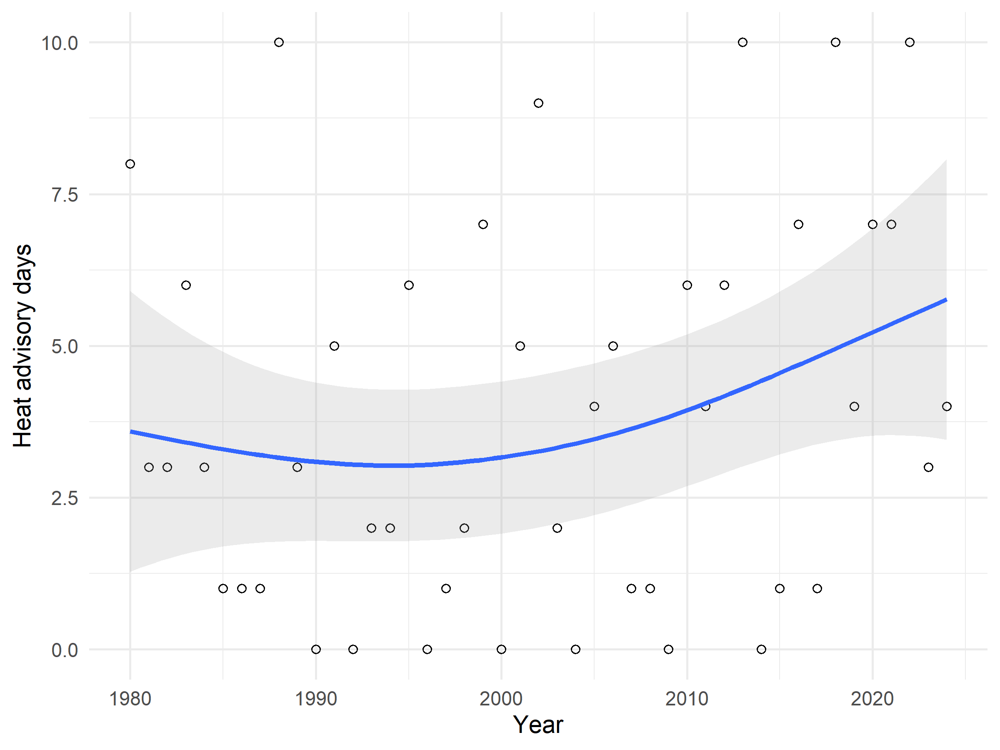
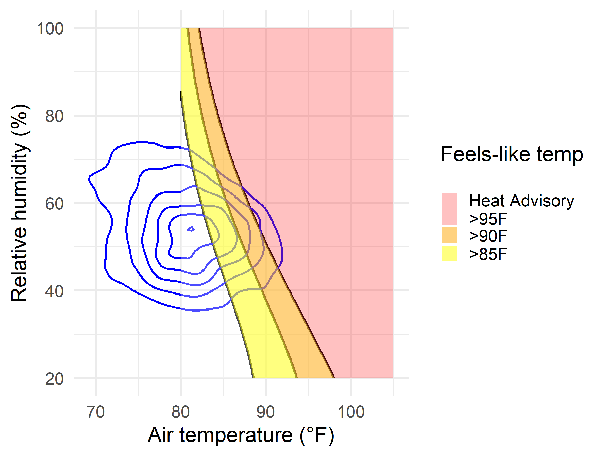

Heat Advisory Days since 1980 at NCYC
================
Riley M. Anderson
April 15, 2026

  

- [Overview](#overview)
  - [Summary of Results](#summary-of-results)
  - [Heat advisory days at NCYC since
    1980](#heat-advisory-days-at-ncyc-since-1980)
  - [How hot is it at the clubhouse?](#how-hot-is-it-at-the-clubhouse)
- [Session Information](#session-information)

## Overview

The analysis pulls daily weather data from
[DAYMET](https://daymet.ornl.gov/) (ORNL & NASA) to provide estimates of
gridded temperature and vapor pressure surfaces for the **NCYC location
since 1980**. The objective is to show how many heat advisory days (NWS
criteria) have occurred each year. Heat index was calculated with the
Rothfusz regression [(Rothfusz
1990)](https://www.wpc.ncep.noaa.gov/html/heatindex_equation.shtml).

Throughout the summer, the **NCYC clubhouse regularly reaches
temperatures above 90°F**. This not only makes for an uncomfortable and
unwelcoming environment, but it poses a major health risk to those over
60 years of age and young children [(Kenny et
al. 2010)](https://www.cmaj.ca/content/182/10/1053). That is, precisely
the population using the clubhouse at these times.

### Summary of Results

- 38 of the last 45 years have had at least one day where a heat
  advisory would be issued by the National Weather Service.

- The number of heat advisory days/year since 1980 ranged from 0-10 with
  mean 3.8

- Over the last 45 years, between June 1 and September 15, feels-like
  temperatures at the clubhouse were above 85°F 26% of the time. 11% of
  this time was above 90°F and 171 heat advisories (\>95°F) were issued
  (4%).

- Serious efforts to cool the clubhouse should be considered.

### Heat advisory days at NCYC since 1980

<!-- -->

- **Heat advisory days** per year since 1980 at the NCYC clubhouse
  (41.289, -72.368). The national weather service defines heat advisory
  days when the heat index (feels-like temperature) is at or above 95°F
  for 2 hours or more. Since the data source, DAYMET only provides Tmax
  on a daily basis (not hourly), the data shown may be slightly
  overestimated. The best fit hindcast (blue line) was generated with a
  generalized additive model with thin plate splines and should not be
  construed as a predictive (forecast) model.

### How hot is it at the clubhouse?

<!-- -->

- **Density contours of the daily maximum temperature from June 1 to Sep
  15.** Blue contours show the density of the raw data with frequency
  diminishing outwards. Black isoclines overlay the heat index where
  yellow indicates feels-like temperatures between 85°F and 90°F, orange
  is 90°F to 95°F, and pink is \>95°F. The national weather service
  issues heat advisories when the heat index is 95°F or greater for 2
  hours or more. The NCYC clubhouse regularly experiences feels-like
  temperatures above 85°F

## Session Information

    R version 4.5.2 (2025-10-31 ucrt)
    Platform: x86_64-w64-mingw32/x64
    Running under: Windows 11 x64 (build 26200)

    Matrix products: default
      LAPACK version 3.12.1

    locale:
    [1] LC_COLLATE=English_United States.utf8 
    [2] LC_CTYPE=English_United States.utf8   
    [3] LC_MONETARY=English_United States.utf8
    [4] LC_NUMERIC=C                          
    [5] LC_TIME=English_United States.utf8    

    time zone: America/New_York
    tzcode source: internal

    attached base packages:
    [1] stats     graphics  grDevices utils     datasets  methods   base     

    other attached packages:
     [1] mgcv_1.9-4      nlme_3.1-168    daymetr_1.7.1   cowplot_1.2.0  
     [5] lubridate_1.9.4 forcats_1.0.1   stringr_1.6.0   dplyr_1.1.4    
     [9] purrr_1.2.1     readr_2.1.6     tidyr_1.3.2     tibble_3.3.1   
    [13] ggplot2_4.0.2   tidyverse_2.0.0

    loaded via a namespace (and not attached):
     [1] generics_0.1.4     stringi_1.8.7      lattice_0.22-7     hms_1.1.4         
     [5] digest_0.6.39      magrittr_2.0.4     evaluate_1.0.5     grid_4.5.2        
     [9] timechange_0.4.0   RColorBrewer_1.1-3 fastmap_1.2.0      rprojroot_2.1.1   
    [13] Matrix_1.7-4       httr_1.4.7         scales_1.4.0       codetools_0.2-20  
    [17] cli_3.6.5          rlang_1.1.7        splines_4.5.2      withr_3.0.2       
    [21] yaml_2.3.12        otel_0.2.0         tools_4.5.2        tzdb_0.5.0        
    [25] ncdf4_1.24         curl_7.0.0         vctrs_0.7.1        R6_2.6.1          
    [29] lifecycle_1.0.5    pkgconfig_2.0.3    pillar_1.11.1      gtable_0.3.6      
    [33] glue_1.8.0         xfun_0.56          tidyselect_1.2.1   rstudioapi_0.18.0 
    [37] knitr_1.51         farver_2.1.2       htmltools_0.5.9    labeling_0.4.3    
    [41] rmarkdown_2.30     compiler_4.5.2     S7_0.2.1          
